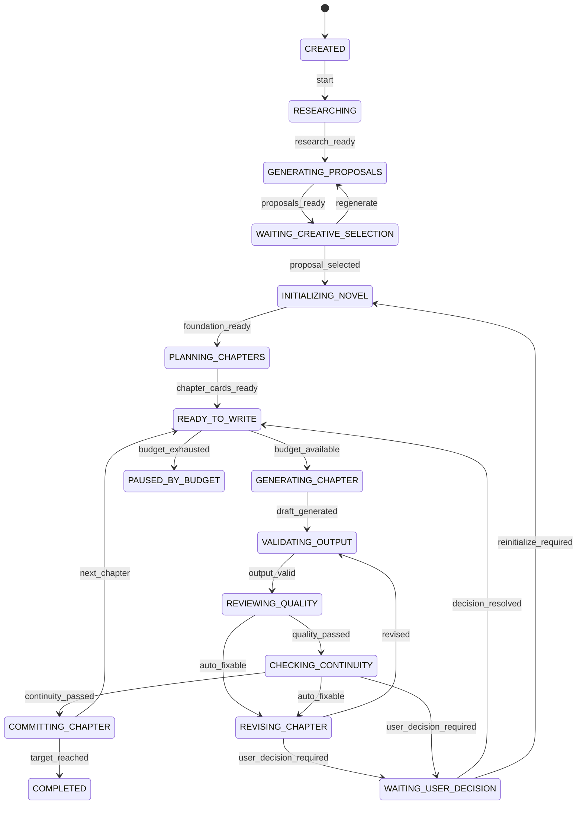

# NovelAgent 状态机与决策规则

## 1. 文档目的

本文定义第一阶段 NovelAgent 的可执行规则，是后续数据库、后端代码、API 和测试的共同依据。

第一阶段只验证一个闭环：

```text
输入一个想法
→ 生成三套差异明显的创意
→ 用户选择一次
→ 自动初始化小说工程
→ 自动连续写作3章
→ 每章自动检查和修订
→ 普通问题不打扰用户
→ 关键问题暂停，处理后可继续
```

NovelAgent 是应用层编排器，不直接写 SQL、不拼接提示词、不调用具体模型 SDK，也不把未经校验的生成内容写入正式事实。

## 2. 第一阶段边界

### 2.1 必须实现

- 支持用户输入想法启动一次 NovelAgent 运行。
- 生成三套创意，等待用户选择、微调或要求重做。
- 自动生成并校验世界观、人物、主线、阶段、伏笔和前10章章节卡。
- 自动逐章生成正文及结构化元数据。
- 自动执行格式、质量和连续性检查。
- 普通问题自动修订，修订后重新检查。
- 每章通过后原子保存正文和全部状态变化。
- 自动连续推进到第3章。
- 支持手动暂停、预算暂停、关键决策暂停和恢复。
- 记录每一步、每次模型调用、检查结果、修订原因和状态变化。

### 2.2 暂不实现

- 真实市场爬取，第一阶段使用人工输入或 Fake Market Provider。
- 同时并发创作多章。
- 多智能体独立部署或消息队列。
- 向量数据库和复杂检索。
- 自动发布小说。
- 登录、会员、计费和多租户。
- 无限自动修订。
- 自动改变主线、结局、核心人物命运或世界核心规则。

## 3. 核心对象

### 3.1 AgentRun

一次从创意到连续写作目标的完整运行。

至少包含：

- `runId`
- `novelId`
- 当前状态 `state`
- 当前步骤 `currentStep`
- 当前章节 `currentChapterNo`
- 目标章节 `targetChapterNo`
- 运行版本 `version`
- 已使用 Token、模型费用和运行时间
- 连续失败次数
- 暂停原因
- 最后成功检查点
- 创建、开始、暂停、完成和更新时间

### 3.2 AgentStep

AgentRun 中一个可重试、可审计的原子步骤，例如市场研究、生成创意、生成世界观、写章节、质量检查或提交章节。

每一步必须记录：

- 唯一步骤 ID 和幂等键。
- 步骤类型、输入快照引用和输出草稿引用。
- `PENDING`、`RUNNING`、`SUCCEEDED`、`FAILED`、`CANCELLED` 状态。
- 尝试次数和最大尝试次数。
- 错误码、错误摘要和是否可重试。
- 模型、提示词模板版本、Token 和费用。
- 开始、结束和下次重试时间。

### 3.3 DraftArtifact

模型生成但尚未成为正式小说事实的草稿。检查失败、进程中断或事务回滚时，草稿可以保留用于诊断，但不能被后续章节作为正式上下文读取。

### 3.4 DecisionRequest

系统无法或不应自动决定的事项。

至少包含：

- 决策类型、标题和背景。
- 触发步骤和影响范围。
- 可选方案、系统建议和各方案影响。
- 优先级与阻塞范围。
- `OPEN`、`RESOLVED`、`CANCELLED` 状态。
- 用户选择、补充意见和处理时间。
- 恢复状态和恢复步骤。

### 3.5 Checkpoint

最近一次可安全恢复的位置。检查点只在正式事务提交后更新，不指向未校验草稿。

第一阶段检查点包括：

- 创意已选择。
- 初始化已完成。
- 第1章已提交。
- 第2章已提交。
- 第3章已提交。

## 4. 状态模型

### 4.1 持久化状态枚举

```text
CREATED                    已创建，尚未开始
RESEARCHING                正在形成市场与创作方向依据
GENERATING_PROPOSALS       正在生成三套创意
WAITING_CREATIVE_SELECTION 等待用户选择、微调或重做
INITIALIZING_NOVEL         正在建立小说工程
PLANNING_CHAPTERS          正在生成当前阶段章节卡
READY_TO_WRITE             初始化完成，准备写当前章节
GENERATING_CHAPTER         正在生成章节草稿
VALIDATING_OUTPUT          正在校验模型输出结构
REVIEWING_QUALITY          正在检查可读性和章节质量
CHECKING_CONTINUITY        正在检查正式事实和连续性
REVISING_CHAPTER           正在根据问题自动修订
COMMITTING_CHAPTER         正在原子提交章节和状态变化
WAITING_USER_DECISION      等待用户处理关键事项
PAUSED                     用户主动暂停
PAUSED_BY_BUDGET           达到章节、费用、Token或时间预算
COMPLETED                  本次运行目标完成
FAILED                     不可自动恢复，等待人工处理
```

状态只允许由 NovelAgent 状态机改变。Controller、模型 Provider 和 Repository 不得直接推进运行状态。

### 4.2 主状态流



任意自动运行状态均允许：

- 用户请求暂停时，在当前不可中断操作结束后进入 `PAUSED`。
- 可重试基础设施错误按重试策略处理。
- 不可恢复错误进入 `FAILED`。

## 5. 状态步骤定义

| 状态 | 主要输入 | 成功输出 | 成功条件 | 失败处理 |
|---|---|---|---|---|
| `RESEARCHING` | 用户想法、题材、偏好、禁用项、可选市场数据 | 市场与创作方向摘要 | 目标读者、机会、风险、差异化建议完整 | 最多重试2次；仍失败则使用“不含市场数据”降级方案并记录警告 |
| `GENERATING_PROPOSALS` | 用户想法、研究摘要 | 3套创意候选 | 三套在核心冲突、人物目标或世界机制上明显不同，且无禁用项 | 最多重试2次；相似则定向重生成重复方案 |
| `WAITING_CREATIVE_SELECTION` | 3套候选 | 用户选择或修改意见 | 选定唯一候选并冻结创意版本 | 不自动超时选择；用户可重做 |
| `INITIALIZING_NOVEL` | 已选创意、用户修改 | 世界、人物、主线、阶段、伏笔、初始事实草稿 | 必填对象齐全且内部引用有效 | 子步骤独立重试；不得保存半成品为正式小说 |
| `PLANNING_CHAPTERS` | 初始化结果、阶段目标 | 前10章章节卡 | 章节连续、阶段目标可达、伏笔节点明确 | 最多重试2次；关键方向冲突时请求决策 |
| `GENERATING_CHAPTER` | 当前章节卡、最小上下文、正式事实 | 正文和结构化元数据草稿 | 正文和元数据均返回 | 模型超时最多重试2次，可切换备用 Provider |
| `VALIDATING_OUTPUT` | 章节草稿 | 规范化草稿或结构错误报告 | JSON字段、引用、章节号和必填项合法 | 结构修复1次，重新生成1次；仍失败则运行失败 |
| `REVIEWING_QUALITY` | 规范化草稿、章节卡、文风要求 | 质量报告 | 无阻断问题，评分达到阈值 | 可自动问题进入修订；方向性问题请求决策 |
| `CHECKING_CONTINUITY` | 草稿、StoryBible、时间线、人物和伏笔 | 连续性报告 | 无事实冲突和禁止事件 | 可明确修复则修订；核心事实变更请求决策 |
| `REVISING_CHAPTER` | 草稿、结构化问题和不可变约束 | 新草稿与修订摘要 | 修订未越过用户决策边界 | 每章最多2轮；达到上限后请求决策 |
| `COMMITTING_CHAPTER` | 已通过检查的草稿 | 正式章节、新事实、检查点 | 单事务全部提交成功 | 整体回滚；数据库瞬时错误最多重试2次 |

## 6. 初始化子步骤

初始化不是一次不可观测的大模型调用，按以下顺序执行：

```text
CREATE_NOVEL_DRAFT
→ GENERATE_WORLD
→ GENERATE_CHARACTERS
→ GENERATE_RELATIONSHIPS
→ GENERATE_MAIN_PLOT
→ GENERATE_STORY_STAGES
→ GENERATE_FORESHADOWING_PLAN
→ BUILD_INITIAL_STORY_BIBLE
→ VALIDATE_NOVEL_FOUNDATION
→ COMMIT_NOVEL_FOUNDATION
```

规则：

- 每个步骤读取已通过校验的前置草稿。
- 每个步骤可单独重试，不重复生成已成功且仍有效的前置步骤。
- 修改上游对象后，所有受影响的下游草稿标记为 `STALE` 并重新生成。
- 只有 `VALIDATE_NOVEL_FOUNDATION` 全部通过后，才允许一次事务提交正式初始化结果。
- 初始化提交成功后建立“初始化已完成”检查点。

## 7. 单章循环

```text
LOAD_CHAPTER_CARD
→ BUILD_CONTEXT
→ GENERATE_CHAPTER
→ PARSE_OUTPUT
→ VALIDATE_SCHEMA
→ REVIEW_QUALITY
→ CHECK_CONTINUITY
→ REVISE_IF_NEEDED
→ RECHECK
→ COMMIT_CHAPTER
→ ADVANCE_PROGRESS
```

### 7.1 最小上下文

仅向模型提供当前任务必要内容：

- 当前章节卡和阶段目标。
- 上一章摘要、结尾和未完成动作。
- 本章相关人物的当前状态、目标、关系和已知信息。
- 本章涉及的世界规则、地点和时间线。
- 当前有效且允许触发的伏笔。
- 禁止提前发生或揭露的事项。
- 用户文风偏好和明确禁用项。

不得默认把整本小说、全部人物和所有历史章节塞入上下文。

### 7.2 正式提交事务

一个章节提交事务至少包含：

- 章节正文、标题、摘要和版本。
- 发生事件和时间线。
- 人物状态、地点、关系和已知信息变化。
- 新增、推进或回收的伏笔。
- StoryBible 新增或更新的正式事实。
- 质量与连续性最终报告。
- AgentStep 成功状态。
- AgentRun 当前章节和检查点。

任何一项失败，事务全部回滚，当前章节不推进。

## 8. 决策规则

### 8.1 决策分级

| 等级 | 处理方式 | 示例 |
|---|---|---|
| `AUTO_FIX` | 自动修订并重新检查 | AI腔、重复表达、节奏拖沓、普通事实表述错误 |
| `AUTO_REPLAN_LOCAL` | 自动调整本章或尚未执行的局部章节卡 | 本章冲突不足、钩子较弱、次要事件顺序不合理 |
| `USER_DECISION` | 创建决策事项并暂停受影响任务 | 重要人物死亡、主线改变、核心规则变化、感情线根本变化 |
| `SYSTEM_PAUSE` | 安全暂停，不要求内容决策 | 达到预算、用户主动暂停、服务维护 |
| `FATAL` | 进入失败状态并保留诊断信息 | 数据损坏、无法满足不变量、关键依赖配置错误 |

### 8.2 自动处理必须同时满足

- 修改可逆。
- 不改变用户已确认的创意承诺。
- 不改变主线目标、结局方向或世界核心规则。
- 不让重要人物死亡、永久退场或根本改变立场。
- 不改变核心感情关系。
- 不推翻已发布或已确认章节中的正式事实。
- 影响范围仅限当前草稿或尚未执行的局部章节卡。
- 未超过修订和预算上限。

任一条件不满足，必须转为 `USER_DECISION`。

### 8.3 第一阶段决策类型

```text
CREATIVE_SELECTION          选择三套创意之一
CORE_PLOT_CHANGE            主线或结局方向变化
MAJOR_CHARACTER_FATE        重要人物死亡、永久退场或立场根本变化
CORE_RELATIONSHIP_CHANGE    核心感情线或关系性质变化
WORLD_RULE_CHANGE           世界核心规则变化
GOAL_MARKET_CONFLICT        市场建议与用户目标明显冲突
REVISION_LIMIT_REACHED      自动修订达到上限
UNRESOLVED_CONTINUITY       无法自动修复的正式事实冲突
```

创意选择是流程中的正常决策；其他类型只有被触发时才打断用户。

### 8.4 决策恢复

用户提交选择后：

1. 校验决策仍处于 `OPEN`，且关联运行没有被新版本替代。
2. 保存用户选择和补充意见。
3. 标记受影响草稿和下游步骤为 `STALE` 或 `CANCELLED`。
4. 将 AgentRun 恢复到 DecisionRequest 中记录的恢复状态。
5. 以新幂等键创建步骤，不能复用旧失败步骤输出。
6. 继续前再次检查剩余预算。

## 9. 重试与失败策略

### 9.1 默认上限

```text
模型网络错误：每步骤最多2次重试
结构化输出修复：1次
同一步骤重新生成：最多2次
每章自动修订：最多2轮
数据库瞬时错误：最多2次重试
同一运行连续基础设施失败：最多3次
```

### 9.2 退避

基础设施重试采用指数退避，建议为5秒、20秒。内容不合格不能通过原样重试解决，应携带结构化问题进入定向修订或重新生成。

### 9.3 失败分类

- `TRANSIENT`：超时、限流、临时网络或数据库连接错误，可重试。
- `CONTENT_INVALID`：输出格式或内容不合格，进入修复、修订或重生成。
- `DECISION_REQUIRED`：超出自动决策边界，创建待决策事项。
- `CONFIGURATION_ERROR`：模型密钥、数据库或必需配置错误，进入 `FAILED`。
- `INVARIANT_VIOLATION`：违反章节号、正式事实或事务不变量，停止并保留证据。

## 10. 暂停、恢复与幂等

### 10.1 安全暂停点

允许在以下位置完成暂停：

- 模型调用开始前。
- 模型响应保存为草稿后。
- 检查或修订步骤结束后。
- 章节提交事务完成后。

不得在数据库事务提交一半时暂停。

### 10.2 进程重启恢复

服务启动后扫描非终态运行：

1. `RUNNING` 且无有效执行租约的步骤视为中断。
2. 查询最后成功检查点和最后成功步骤。
3. 未正式提交的草稿不得作为 StoryBible 正式事实。
4. 可重试步骤恢复为 `PENDING`，尝试次数加一。
5. `WAITING_USER_DECISION`、`PAUSED` 和 `PAUSED_BY_BUDGET` 保持原状态，不自动继续。
6. `COMMITTING_CHAPTER` 必须先按幂等键检查事务是否已成功，不能直接重复插入章节。

### 10.3 幂等键

建议格式：

```text
run:{runId}:step:{stepType}:subject:{subjectId}:revision:{revisionNo}
```

同一个幂等键只能产生一个成功结果。重试不得重复创建小说、章节、事件、伏笔或正式事实。

### 10.4 并发规则

- 一个 NovelAgent 运行同一时刻只有一个步骤可持有执行租约。
- 一本小说同一时刻只允许一个会改变正式事实的运行。
- 查看、检查历史和读取进度不受此限制。
- 第一阶段不允许第2章在第1章正式提交前开始生成。

## 11. 运行预算

### 11.1 第一阶段默认预算

```text
目标章节数：3章
单章目标字数：约3000字
单章自动修订：最多2轮
单步骤模型重试：最多2次
整次运行最长自动执行时间：60分钟
最大连续失败次数：3次
Token和费用：必须配置上限，未配置时禁止接入真实付费模型自动运行
```

使用 Fake Provider 时仍记录模拟 Token 和费用，以验证预算流程。

### 11.2 预算检查时机

- 运行开始前。
- 每次模型调用前。
- 每轮修订前。
- 每章提交并准备进入下一章前。

达到上限时：

- 保存当前安全状态和暂停原因。
- 进入 `PAUSED_BY_BUDGET`。
- 不创建内容决策事项。
- 用户提高预算或设置新的目标后才允许恢复。

## 12. 质量与连续性门槛

### 12.1 阻断问题

出现以下任一问题，不得提交：

- 正文为空、章节号错误或结构化元数据无法解析。
- 违反世界核心规则。
- 已死亡或不在场人物无解释出现。
- 时间顺序或地点变化无法成立。
- 提前揭露禁止公开的隐藏设定。
- 重要事件与章节卡目标完全无关。
- 需要用户决策的重大变化被擅自写入正文。
- 修订后仍存在高严重度冲突。

### 12.2 可自动修订问题

- 明显重复表达。
- 对话或叙述存在明显模板化、AI腔。
- 节奏局部拖沓或跳跃。
- 爽点、情绪承诺或结尾钩子不足。
- 与正式事实一致但表述含糊。
- 不改变剧情方向的场景、动作和衔接问题。

### 12.3 通过条件

- 所有阻断问题为0。
- 高严重度质量问题为0。
- 中低严重度问题已修复，或被明确接受并记录理由。
- 结构化元数据与正文一致。
- StoryBible 更新候选可以由正文证据支持。

第一阶段不要依赖一个不可解释的总分直接放行章节，必须保留结构化问题列表和规则结果。

## 13. API 行为草案

后续 API 应围绕目标和状态，而不是暴露内部每个 Agent 按钮：

```text
POST /api/novel-agent/runs
用途：输入想法并创建一次运行。

GET /api/novel-agent/runs/{runId}
用途：查看当前状态、进度、预算和最近步骤。

POST /api/novel-agent/runs/{runId}/creative-selection
用途：选择、微调或要求重做创意。

POST /api/novel-agent/runs/{runId}/pause
用途：请求在安全点暂停。

POST /api/novel-agent/runs/{runId}/resume
用途：从检查点恢复运行。

GET /api/novel-agent/runs/{runId}/decisions
用途：查看阻塞运行的待决策事项。

POST /api/novel-agent/decisions/{decisionId}/resolve
用途：提交用户选择并恢复受影响任务。
```

每个接口后续必须提供中文 Swagger 说明和真实 Spring Security 权限控制。

## 14. 第一阶段验收场景

### 场景A：正常完成三章

```text
给定一个用户想法
当系统生成三套创意且用户选择其中一套
那么系统自动完成初始化
并依次生成、检查、提交第1至第3章
最终运行状态为 COMPLETED
且存在3个章节检查点
```

### 场景B：普通质量问题自动修订

```text
给定第1章首次草稿存在重复和AI腔
当质量检查返回可自动修订问题
那么系统进入 REVISING_CHAPTER
并在修订后重新检查
且不会创建用户决策事项
```

### 场景C：重大人物命运必须询问

```text
给定草稿计划让重要人物永久死亡
且该变化未在已确认规划中
那么系统不得提交章节
并创建 MAJOR_CHARACTER_FATE 决策事项
运行进入 WAITING_USER_DECISION
```

### 场景D：修订达到上限

```text
给定章节连续2轮修订仍存在阻断问题
那么系统创建 REVISION_LIMIT_REACHED 决策事项
保留所有草稿和检查记录
且不推进章节或更新StoryBible
```

### 场景E：服务中断恢复

```text
给定服务在第2章草稿生成后中断
当服务重新启动
那么系统从最后正式检查点恢复
不得重复创建第1章
也不得把未提交的第2章草稿写入正式事实
```

### 场景F：预算暂停

```text
给定运行在进入第3章前达到费用或时间上限
那么系统进入 PAUSED_BY_BUDGET
保留前2章正式结果
且提高预算后可以继续第3章
```

### 场景G：提交事务回滚

```text
给定章节正文保存成功但人物状态更新失败
那么整个章节提交事务回滚
当前章节号不推进
StoryBible和伏笔状态不发生部分更新
```

## 15. 数据库设计必须支持

下一步数据库至少需要表达：

- 小说项目和已确认创意版本。
- AgentRun、AgentStep、执行租约和检查点。
- 草稿产物及其正式/过期状态。
- 市场研究快照和三套创意候选。
- 初始化对象及版本关系。
- 章节卡、章节草稿、正式章节和版本。
- 质量报告、连续性报告、问题和修订记录。
- 人物、关系、世界规则、事件、时间线和伏笔。
- StoryBible 正式事实及来源证据。
- DecisionRequest、选项、用户回答和恢复位置。
- 模型调用、提示词版本、Token、费用和错误。
- 幂等键、乐观锁版本和事务提交标识。

表结构不能只围绕页面增删改查设计，必须优先保证状态机可恢复、步骤可审计、草稿与正式事实隔离以及章节事务一致性。

## 16. 实现顺序

```text
状态枚举和转移规则
→ AgentRun / AgentStep / DecisionRequest 数据模型
→ 状态机领域测试
→ Fake Market Provider 和 Fake Model Provider
→ 初始化编排
→ 单章生成与检查编排
→ 自动修订
→ 章节事务提交
→ 暂停恢复和预算
→ 三章端到端验收
```

在 Fake Provider 跑通全部验收场景前，不接真实付费模型，不开发复杂 App 和管理后台。
