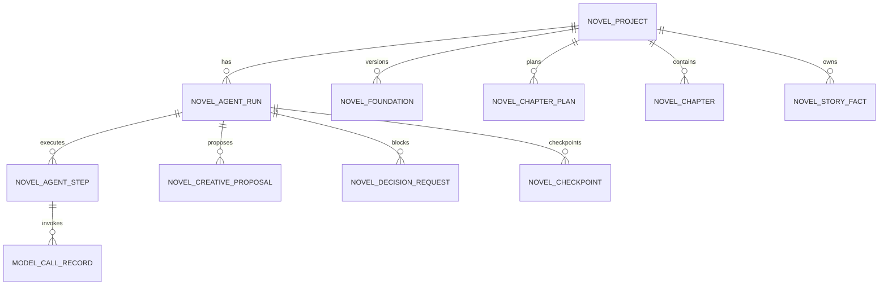

# 第一阶段数据库设计

## 1. 设计目标

数据库需要同时回答两个问题：

1. 小说当前有哪些正式内容和事实。
2. NovelAgent 运行到了哪里、为什么暂停、如何安全恢复。

第一阶段采用 MySQL 8.0、InnoDB、`utf8mb4` 和 Flyway。模型生成结果先作为草稿保存，只有通过结构、质量与连续性检查后，才在事务中写入正式章节和检查点。

## 2. 表关系



## 3. 核心表

### 3.1 `novel_project`

小说项目聚合根，保存用户原始想法、当前状态、当前正式章节和所选创意。

关键约束：

- `current_chapter_no` 只在章节事务提交成功后推进。
- `selected_proposal_id` 只能指向本项目当前运行产生的创意。
- 使用 `version` 做乐观锁，防止两个运行同时推进一本小说。

### 3.2 `novel_agent_run`

一次 NovelAgent 自动运行。保存状态机当前状态、目标章节、预算消耗、暂停原因和最后检查点。

关键约束：

- 一本小说同一时间最多有一个可改变正式事实的非终态运行。
- 状态只能由 NovelAgent 状态机修改。
- `target_chapter_no` 表示本次运行完成后应达到的正式章节号，第一阶段默认为3。

### 3.3 `novel_agent_step`

运行中的原子步骤。每一步有唯一幂等键、输入/输出 JSON、尝试次数和错误分类。

关键约束：

- `idempotency_key` 全局唯一。
- 同一运行只能有一个持有有效执行租约的步骤。
- 成功步骤不可被原地覆盖；重新执行创建新修订步骤。

### 3.4 `novel_creative_proposal`

三套创意候选。保存标题、核心设定、市场依据、差异化、风险和是否被选择。

关键约束：

- 同一运行 `proposal_no` 唯一。
- 第一阶段每次成功提案必须恰好产生3条。
- 同一运行最多选择1条。

### 3.5 `novel_foundation`

小说初始化版本，保存世界、人物、关系、主线、阶段、伏笔与初始 StoryBible 的结构化 JSON。

第一阶段先用版本化 JSON 验证自主流程；进入长篇版本后，再按查询和一致性需求逐步拆分人物、关系、规则、时间线和伏笔表。

### 3.6 `novel_chapter_plan`

章节卡。第一阶段初始化时只创建第1至第10章。

每张卡至少保存目标、冲突、关键事件、人物变化、伏笔动作、高潮、结尾钩子和禁止事件。

### 3.7 `novel_chapter`

只保存已经通过检查并正式提交的章节版本。

关键约束：

- `(project_id, chapter_no, version_no)` 唯一。
- `content` 与结构化元数据、最终质量报告和连续性报告一起保存。
- 未通过检查的正文只能存在于 `novel_agent_step.output_json`，不能插入本表。

### 3.8 `novel_story_fact`

StoryBible 的正式事实。保存事实类型、主体、谓词、值、来源章节和有效状态。

第一阶段支持最小事实查询和来源追踪；任何新事实必须能追溯到初始化版本或正式章节。

### 3.9 `novel_decision_request`

关键用户决策。保存决策类型、影响范围、选项、系统建议、用户回答和恢复状态。

关键约束：

- 内容决策与预算暂停分开，预算暂停不创建决策记录。
- 决策完成后不能修改原回答，只能创建新的纠正决策。

### 3.10 `novel_checkpoint`

安全恢复点。第一阶段包括创意已选择、初始化完成和每章提交完成。

检查点必须与正式事务一起创建，不能指向未校验草稿。

### 3.11 `model_call_record`

记录 Provider、模型、任务类型、提示词模板版本、Token、费用、耗时和错误，支持预算控制与未来模型效果比较。

不得保存模型密钥。提示词正文默认不直接保存，可保存脱敏后的输入摘要或内容哈希。

## 4. 状态与数据隔离

```text
生成输出
→ novel_agent_step.output_json（草稿）
→ 质量与连续性检查
→ 通过
→ 单事务写入 novel_chapter / novel_story_fact / novel_checkpoint
→ 更新 novel_project 和 novel_agent_run
```

检查失败时：

- 保留步骤输出和问题报告用于诊断。
- 不更新 `novel_project.current_chapter_no`。
- 不插入正式章节。
- 不新增或修改有效 StoryBible 事实。

## 5. 事务边界

### 5.1 选择创意

一个事务内：

- 标记唯一选中创意。
- 更新项目所选创意。
- 将运行推进到 `INITIALIZING_NOVEL`。
- 创建“创意已选择”检查点。

### 5.2 初始化提交

一个事务内：

- 插入正式 `novel_foundation` 版本。
- 插入前10章 `novel_chapter_plan`。
- 插入初始化 StoryBible 事实。
- 更新项目状态和基础版本。
- 将运行推进到 `READY_TO_WRITE`。
- 创建“初始化完成”检查点。

### 5.3 章节提交

一个事务内：

- 插入正式章节。
- 插入或更新 StoryBible 事实。
- 更新章节卡状态。
- 更新项目和运行的当前章节。
- 标记提交步骤成功。
- 创建章节检查点。
- 达到目标时将运行改为 `COMPLETED`，否则回到 `READY_TO_WRITE`。

任意 SQL 失败时整体回滚。

## 6. 索引原则

- 运行按 `project_id + state` 查询。
- 步骤按 `run_id + status`、`lease_until` 查询。
- 创意按 `run_id + proposal_no` 查询。
- 章节与章节卡按 `project_id + chapter_no` 查询。
- 正式事实按 `project_id + fact_type + subject_key + status` 查询。
- 待决策按 `run_id + status + priority` 查询。
- 模型调用按 `run_id + created_at` 汇总预算。

第一阶段不添加搜索引擎或向量索引。

## 7. 数据保留

- 正式章节、事实、决策和模型用量记录长期保留。
- 失败步骤和草稿至少保留到运行完成后，方便复盘。
- 后续可以增加草稿归档策略，但不能删除仍被决策、检查或审计记录引用的内容。

## 8. Flyway

```text
V1__initialize_schema.sql
V2__create_novel_agent_core.sql
```

`V2` 一旦在共享环境执行，不得修改。后续调整通过 `V3` 及更高版本前滚。
